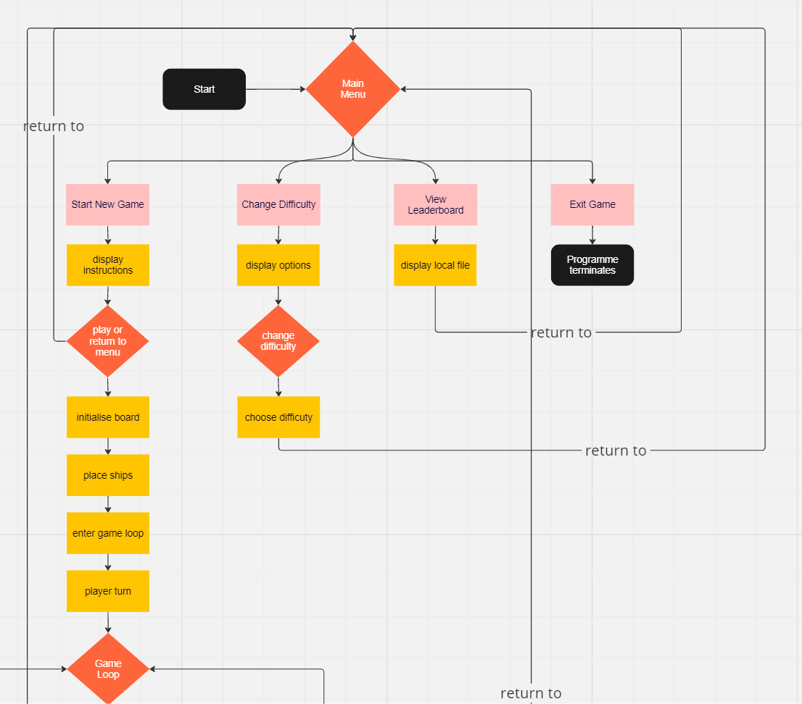

Welcome to, 

# Battleship

Live link - [Battleship](https://python-project-bs-game-0c8cb15b2dbe.herokuapp.com/)

## Introduction

- Battleship is a classic naval strategy game, adapted here for play via the command line.
- The game pits the player against a computer opponent in a battle to sink each other's fleet of ships.

## Table of Contents

- [Project Goals](#project-goals)
- [User Experience](#user-experience)
- [Design](#design)
- [Features](#features)
- [Technologies](#technologies-used)
- [Testing](#testing)
- [Bugs](#bugs)
- [Deployment](#deployment)
- [Clone a repository code locally](#clone-a-repository-code-locally)
- [Forking in GitHub](#forking-in-github)
- [Credits](#credits)

## Project Goals

- __User Goals__
    - Engaging and intuitive gameplay
    - Reliable and responsive interaction
    - Easy to understand instructions

- __Site Owner Goals__
    - Showcase programming skills
    - Provide an enjoyable game experience
    - Encourage user engagement and feedback

[Back to Table of Contents](#table-of-contents)

## User Experience

- __Target Audience__
    - Casual gamers
    - Fans of strategy games
    - Individuals looking to improve their decision-making and planning skills.
    - Players seeking a quick and accessible game experience via the command line.
    - Individuals interested in command-line applications

- __User Stories__
    - As a player, I want to enjoy a challenging and fair game.
    - As a player, I want to be able to play Battleship in a digital format, so that I can enjoy the game without physical components.
    - As a user, I want clear instructions on how to play the game, so that I can understand the gameplay without prior knowledge of Battleship.
    - As a player, I want to view the leaderboard and see my high scores.
    - As a strategic player, I want the computer opponent to be able to play on different sizes of boards, so that the game remains engaging and competitive.

[Back to Table of Contents](#table-of-contents)

## Design

- __Design Choices__
    - Simple, text-based interface for easy navigation
    - Clear and concise instructions for user guidance
    - Strategic use of colors to enhance user experience

- __Flowchart__
    - The game flow was planned with a detailed flowchart, ensuring a logical progression and a smooth user experience.
    
    

[Back to Table of Contents](#table-of-contents)

## Features

#### Welcome screen

- Users are greeted with the game name and instructions on how to start.

#### Game rules

- Clear explanation of the game rules and mechanics.

#### Game play

- On the welcome screen, the user is greeted with the game's name and a prompt to enter their name for a personalized experience.
- Users engage in strategic gameplay against a computer opponent.
- The game's interface displays hit or miss feedback and updates on ship status.
- The game's loop allows for viewing pc attacks and exiting midgame anytime the user wishes.

#### Game Over

- When the game concludes, the user is presented with options to try again or finish the game. The final state of both the user's and the computer's boards are displayed, along with the outcome of the match

#### Leaderboard

- The leaderboard feature showcases the high scores and game outcomes for player.

[Back to Table of Contents](#table-of-contents)

### __Technologies Used__

- Python: The primary language for game development.
- GitHub: Used to store and manage the project's code.
- Gitpod/VSCode: The integrated development environment for coding and version control.
- Git: Employed for version control via the VSCode terminal.
- Heroku: Platform for deploying and managing the application.

[Back to Table of Contents](#table-of-contents)

## Testing

#### Python Validation 

- All Python modules were thoroughly tested and validated using CI Python linters to ensure code quality and adherence to Pythonic conventions PEP8.
- Errors were all related to four main issues, trailing white spaces, line length, indentation levels and spaces around keyword/parameter "="

- E501 line too long (117 > 79 characters)
- W291 trailing whitespace
- E302 expected 2 blank lines, found 1
- E251 unexpected spaces around keyword / parameter equals
- W293 blank line contains whitespace
- E101 indentation contains mixed spaces and tabs
- W191 indentation contains tabs
- E306 expected 1 blank line before a nested definition, found 0

#### Validation Error-based Fixes
- Navigation menu validation

- Game loop validation

[Back to Table of Contents](#table-of-contents)

## Manual Testing

| Section Tested | Input To Validate | Expected Outcome | Actual Outcome | Pass/Fail |
| -------------- | ----------------- | ---------------- | -------------- | --------- |
| Welcome screen | Name Entry        | Acceptance of alphanumeric characters for the player name | As expected | Pass      |
| Gameplay       | Coordinate Input  | Acceptance of valid board coordinates with appropriate action (hit/miss) | As expected | Pass      |
| Game Over      | N/A               | Display of the final game state and options to play again or quit | As expected | Pass      |
| Leaderboard    | N/A               | Accurate reflection of wins and losses | As expected | Pass      |

[Back to Table of Contents](#table-of-contents)

## Bugs
- Throughout the development process, several bugs were encountered and resolved. Below is a list of notable bugs and their resolutions:

| Bug | Fix |
| --- | --- |
| Multiple hits on the same ship coordinate | Adjusted `take_shot` method to flag coordinates that have already been hit |
| Incorrect leaderboard update | Corrected logic in the `update_score` method to properly increment wins and losses |
| Game prematurely ending | Ensured that the game checks for all ships being sunk before declaring the game over |

- Some bugs are still being worked on:

| Bug | Status |
| --- | ------ |
| Game speed inconsistency | In progress - adjusting typing effect speeds |

[Back to Table of Contents](#table-of-contents)

## Deployment

### Version Control

- The Battleship game was developed using Visual Studio Code and version controlled via Git and GitHub.
- I used Visual Studio code editor to create my site and pushed to GitHub to the remote repository.
- The following git commands were used in development to push code to the remote repo:
- git add - This command was used to add the file(s) to the staging area before they are committed.
- git commit -m “commit message” - This command was used to commit changes to the local repository queue ready for the final step.
- git push - This command was used to push all committed code to the remote repository on github.

### Heroku Deployment

- The application was deployed to Heroku, making it accessible to users online.
- The Battleship game, being a command-line application, is hosted on Heroku, allowing users to play it directly from their browsers.
- Deploying on Heroku:
- A Procfile and requirements.txt file were created to specify the commands that are executed by the app on startup.
- The app was linked to the GitHub repository for automatic deployment upon updates to the main branch.
- The live link to play the game is available here: 
Live link - [Battleship](https://python-project-bs-game-0c8cb15b2dbe.herokuapp.com/)

### Clone a repository code locally

- Step-by-step guide on how to clone the repository locally.
- To clone the Battleship repository code to your local machine:
- Access the repository URL of the remote repository you want to clone.
- Click on the green 'Code' button.
- Under 'HTTPS', copy the repository link.
- In your IDE, open the terminal.
- Paste the repository link into the terminal.
- Git will download all the files from the remote repository to your local machine. Once the process is finished, you'll have a local copy of the repository.

[Back to Table of Contents](#table-of-contents)

### Forking in GitHub

- Instructions on how to fork the repository for personal modification and contribution:
- Go to the GitHub repository: Battleship GitHub Repository.
- Click the 'Fork' button on the top right corner of the repository page.
- You will be redirected to your fork of the repository. This version is a copy of the original.
- You can now make changes, add features, fix issues, or modify the code within your fork. 
- These changes do not affect the original repository.
- If you want to propose your changes to the original project, create a "Pull Request." 
- The original repository owner can then review and decide whether to merge your contributions.

[Back to Table of Contents](#table-of-contents)

## Credits
Thanks to my mentor Medale Oluwafemi for his guidance and support. 

### Design

- Design inspired by traditional Battleship games, adapted for a command-line interface.

## Acknowledgements

- Thanks to the Python community, Heroku, and beta testers.

[Back to Table of Contents](#table-of-contents)

---
